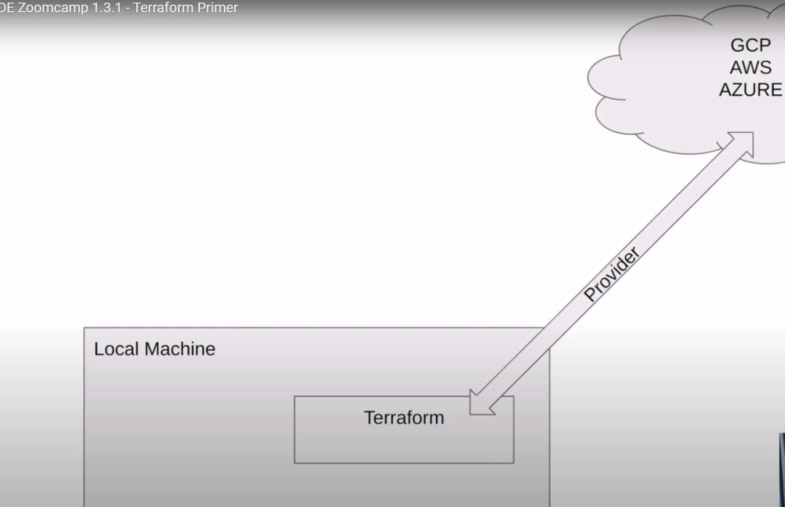

# DE Zoomcamp 2024
Add a catchy title to your project. Something that people immediately know what you are doing

# Introduction & Goals
- Introduce your project to the reader
- Orient this section on the Table of contents
- Write this like an executive summary
  - With what data are you working
  - What tools are you using
  - What are you doing with these tools
  - Once you are finished add the conclusion here as well

# Contents

- [Environment setup](#Environment-setup)  
  - [Setting up the environment on GCP cloud VM](#setting-up-the-environment-on-gcp-cloud-vm)
- [Week 1](#week-1)
- [Used Tools](#used-tools)
  - [Connect](#connect)
  - [Buffer](#buffer)
  - [Processing](#processing)
  - [Storage](#storage)
  - [Visualization](#visualization)
- [Pipelines](#pipelines)
  - [Stream Processing](#stream-processing)
    - [Storing Data Stream](#storing-data-stream)
    - [Processing Data Stream](#processing-data-stream)
  - [Batch Processing](#batch-processing)
  - [Visualizations](#visualizations)
- [Demo](#demo)
- [Conclusion](#conclusion)
- [Follow Me On](#follow-me-on)
- [Appendix](#appendix)

# Environment setup
- For the course you'll need:  
  * Python 3 (e.g. installed with Anaconda)
  * Google Cloud SDK
  * Docker with docker-compose
  * Terraform
  ## Setting up the environment on GCP cloud VM  
    * __Generating SSH keys__  
      1. Open Git Bash and under users home dir (/c/Users/Admin) do *__mkdir .ssh__*
      2. From the link, https://cloud.google.com/compute/docs/connect/create-ssh-keys, Create an SSH key pair  
        a. Use cmd - ssh-keygen -t rsa -f KEY_FILENAME(use *__gcp__*) -C USERNAME(*your name preferred*) -b 2048  
        b. Enter passphrase (empty for no passphrase): *just hit enter, we dont want any pass phrase*  
        c. do *ls* and it should list two keys, private key- *gcp* and public key - *gcp.pub*
      3. Configure VM with ssh public key  
        a. In GCP console, under Compute Engine, go to Metadata  
        b. Under SSH keys tab, add public SSH Key value and hit save. To copy value of *gcp.pub*, use *__cat gcp.pub__* 
    * __Create VM__  
      1. Under Create an instance  
        a. Change name to de-zoomcamp  
        b. Select Region  
        c. Under Machine Config, select *series* - *E2* , *Machine type* - *e2-standard-4*   
        d. Under Boot Disk, select *Image type* - *Ubuntu 20.04 LTS*, *size* - *30 GB*  
        e. Hit Create  
    * __ssh into VM__  
      1.  Copy the external IP of the VM created  
      2. In git bash, run cmd *__ssh -i ~/.ssh/gcp faisal@external_ip__*  
      3. It should be able to connect you into the VM, the terminal will change to __faisal@de-zoocamp:~$__  
      4. type cmd gcloud --version to check details like Google SDK version etc
    * __Configure VM and setup local ~/.ssh/config__  
      1. Install Anaconda using __wget__ <*link of the Anaconda Linux installer*> 
      2. To automatically activate the Conda base environment upon logging into your VM:  
        a. do *__vim ~/.bashrc__*  
        b. Go to the end of the file and press 'i' to activate insert mode  
        c. Paste to the end, `eval "$(/path/to/your/anaconda3/bin/conda shell.bash hook)"`  
        d. Press __Esc__ to exit insert mode, then type `:wq` to save and exit __vim__ editor  
        e. type logout  
        f. Type `ssh de-zoomcamp` to login back into the VM, and it will show `(base)` representing conda activation  
      3. Set up local ssh config:  
        a. Go to home dir in git bash, do *touch config* to create config file under folder ~/.ssh   
        b. Open the config file in VScode using cmd *code config*  
        c. Add following details and save the file    
          1. Host de-zoomcamp
          2. Hostname <*external ip of the VM*>  
          3. User faisal  
          4. IdentityFile <*c:/full-path-of-private-ssh-key (/.ssh/gcp)*>.    
        d. From git bash terminal, go to home dir and enter cmd - *__ssh de-zoomcamp__*, to ssh into the VM 
      4. Configure VM (cont.):  
         * Clone Repo:  
            1. Clone data-engineering-zoomcamp repo to de-zoomcamp VM. Use __git clone <*http-link*>__  
         * Execute Commmand Docker run and install docker-compose: 
            1. Cmd __docker run hello-world__ complains of permission issues.  
            2. c. Go-to link [Run Docker commands without sudo](https://github.com/sindresorhus/guides/blob/main/docker-without-sudo.md). Follow first 3 steps. logout of VM and log back in  
            3. Retry  __docker run hello-world__. It should successfully pull the image  
            4. go to [Docker Compose Releases](https://github.com/docker/compose/releases/tag/v2.24.1). Copy the link to the latest [release](https://github.com/docker/compose/releases/download/v2.24.1/docker-compose-linux-x86_64)   
            5. inside folder ~/bin, do __wget <*docker-compose-link*> -O docker-compose__  
            6. Make the docker-compose executable. Use cmd: __chmod +x docker-compose__  
            7. From bin, run cmd : __./docker-compose version__ . It should list the version of it  
         * Add docker-compose to the PATH variable to be able to execute docker-compose from any directory:  
            1. Run cmd __nano .bashrc__ . It opens the bashrc file
            2. At the end of the file, add __export PATH="${HOME}/bin:${PATH}"__ . The command prepends the path of the binaries to the the PATH variable  
            3. Hit CTRL+O to save it. Hit CTRL+X to exit the nano editor  
            4. Run __source .bashrc__ to restart/logout-and-login  
            5. Run __which docker-compose__ . It should print the path of docker-compose in __~/bin__
            6. Run __cd data-engineering-zoomcamp/01-docker-terraform/2_docker_sql__  
            7. Run __docker-compose up -d__ . It should pull sql images in the docker file under the folder  
         * Configure VSCode to open repo in remote folder:  
           1.  In the VSCode window that already has ssh VM connected, go-to file explorer.  
           2. Click __Open the folder__ . It should list the options of folders within the de-zoomcamp VM directory.
           3. Select __data-engineering-zoomcamp__ and hit okay. 
         * Install pgcli:  
           1. In VSCode, from the readme file under __data-engineering-zoomcamp/01-docker-terraform/2_docker_sql/README.md__, copy the line, `conda install -c conda-forge pgcli`   
           2. From the git bash terminal, run the copied cmd above.
           3. if it results in spinning forever (over 10min) to "Solving environment":  
              * Run following commands from terminal:  
                1. conda create -n pgcli  
                2. conda activate pgcli  
                3. conda install -c conda-forge pgcli  
           4. Run cmd:  __pgcli -h localhost -p 5432 -u root -d ny_taxi__
         * Setup port forwarding to local machine:  
           1.      

    * __ssh with VS Code__  
      1. In VS Code install the extension *__Remote - SSH__*
      2. In the left bottom corner of the screen, click on the icon __><__. It lists option to connect to remote host via ssh
      3. Since there is a config file with ssh host details for de-zoomcamp, it automatically lists it.
      4. Upon clicking on de-zoomcamp, it should be successfully connected. The termal will show conda actived
          
# Week 1  
  ## Docker + Postgres
  * __1.2.1 - Introduction to Docker Introduction to Docker__  
    - What is Docker?  
      Docker is a set of Platform as a service products that use OS-level virtualization to deliver software in packages called 
        containers.
    - Why should DE care about docker?  
      1. Reproducability- The project can be bundled as image and deployed to docker.  
           It can then be run on different platforms, like AWS, Google cloud (Kubernetes)
      2. Local Experiments 
      3. Integration Tests (CI/CD) - Making sure connections are successfully established and expected results at the end of 
           pipeline run are validated. e.g. count of rows expected in postgres are same as retrieved from it after pipeline execution.
    - Hands on:  
      1. Created Dockerfile to make docker python image install pandas everytime it is run.  
      2. Added pipeline.py file to use sys.argv, for reading the parameters passed to docker run cmd.  
         e.g   docker run -it test:pandas 2024-01-21, it uses the date as argv[1] and prints it.
  * __1.2.2 - Ingesting NY Taxi Data to Postgres__
  * __1.2.3 - Connecting pgAdmin and Postgres__  
  * __1.2.4 - Dockerizing the Ingestion Script__  
    - Convert notebook upload-data to python script:  
      1. From the subfolder, *../2_docker_sql/*, Use cmd: `jupyter nbconvert --to=script upload_data.ipynb`
      2. Rename the script `upload-data.py` to `ingest_data.py`
      3. Parametrize the script `ingest_data.py` using argparse to pass following variables as args:  
         *user, password, host, port, database, tablename, url from where we download the csv*
      4. Test it using cmd:
         `python ingest_data.py    
            --user=root   
            --password=root  
            --host=localhost 
            --port=5432 
            --db=ny_taxi 
            --table_name=yellow_taxi_data 
            --url="https://github.com/DataTalksClub/nyc-tlc-data/releases/download/yellow/yellow_tripdata_2021-01.csv.gz"`
      5. Build a docker image using cmd `docker build -t taxi_ingest:v001 .`
      6. Run it on the network `pg-network`, on which postgres and PgAdmin are running in the docker.  
         Use cmd: `docker run -it 
                      --network=pg-network 
                      taxi_ingest:v001  
                        --user=root  
                        --password=root  
                        --host=pg-database  
                        --port=5432  
                        --db=ny_taxi  
                        --table_name=yellow_taxi_data  
                        --url="https://github.com/DataTalksClub/nyc-tlc-data/releases/download/yellow/yellow_tripdata_2021-01.csv.gz"`
  * __1.2.5 - Running Postgres and pgAdmin with Docker-Compose__
    - Configuration of postgres database and pgadmin in Docker-Compose file:  
      1. Create file `docker-compose.yaml` under *__./2_docker_sql__*
      2. Populate the servicees and networks section for postgres and pgadmin
    - Running the Docker-Compose file:  
      1. Run it usin cmd `docker-compose up`. Make sure to run it from the directory containing the file docker-compose.yaml
    - Connecting to pgadmin and configuration:  
      1. Open pgadmin on port 8080, login and connect to pg-database to check if database ny_taxi exists
  * __1.2.6 - SQL Refreshser__
    - Demonstrated some sql queries to cover topics like joins, groupby, orderby. No new learning or addition to codebase

  ## GCP
  * __1.1.1 - Introduction to Google Cloud Platform__
  ## Terraform
  * __1.3.1 - Terraform Primer__  
    - What is Terraform?  
      HashiCorp Terraform is an infrastructure as code tool that lets you define both cloud and on-prem resources in human-readable configuration files that you can version, reuse, and share. You can then use a consistent workflow to provision and manage all of your infrastructure throughout its lifecycle. 
    - Why Terraform?
      * Simplicity in keeping track of infrastructure -  
        By defining it in file, you can read it and see whats going to be made with what params.
      * Easier collaboration -  
        People can look at it, make additions and push changes that can be deployed to infrastructure.
      * Reproducability 
      * Ensure resources are removed -  
        Once built and tested, you can bring down the resources when not needed, to avoid extra charges
      * Architecture  
        
      * Key Terraform commands  
        - Init - Get me the providers I need
        - Plan - What am i about to do?
        - APply - Do whats is in the tf (terraform) files
  * __1.3.2 - Terraform Basics__
    - If using github codespace, install terraform using __wget__.  
       Make sure to unzip it and move to a directory that is included in your PATH so that you can execute it from any location.  
       Use the mv command to move the Terraform binary to a directory in your PATH, such as /usr/local/bin. This ensures Terraform is globally accessible `sudo mv terraform /usr/local/bin/`  
      Verify Installation:  
        * You can verify that Terraform is installed correctly by running:`terraform version`
    - Create demo project folder in GCP
      1. Go to console and create a new project named __terraform-demo__ .  
         Or if adding to the project week 1, continue with the project __ny-rides-faisal__
    - Create a service account
      1. Under __IAM % Admin__, click on __Service Accounts__
      2. Add Service account details, name it __terraform-runner__ or __terraform__ for prject __ny-rides-faisal__
      3. Grant this service account access to:  
        * Cloud Storage -> Assign role 'Storage Admin'
        * Compute Engine -> Assign role 'Compute Admin'
        * BigQuery -> Assign role 'BigQuery Admin'
    - Create permission keys for Service Account __terraform-runner__
      1. Under __IAM % Admin__, click on __Service Accounts__
      2. For the service account seen on screen, click on the 3 dots for Actions, hit __Manage Keys__
      3. Click __Add Key__, select __Create new key__. Select JSON format
    - Setup project folder __terrademo__
      1. Add the downloaded json key file to folder __/terrademo/keys/__, as *my-creds.json*. Make sure to include it in gitignore
      2. Create file main.tf . Also, install extension 'Hashicorp Terraform'
      3. Copy the terraform template for [__Google Cloud Platform Provider__](https://registry.terraform.io/providers/hashicorp/google/latest/docs), in the main.tf
      4. Change the project option under provider to your project ID for GCP project __terraform-demo__
      5. Add the credentials option under provider, the value is the complete path to the json file __/terrademo/keys/my-creds.json__
      6. on terminal hit cmd: __terraform init__ to access the GCP resource using credentials configured in file __main.tf__
      7. Add the terraform template for creating google storage bucket from [__google_storage_bucket__](https://registry.terraform.io/providers/hashicorp/google/latest/docs/resources/storage_bucket), in the __main.tf__ under __Google Cloud Platform Provider__
      8. Notice the line `resource "google_storage_bucket" "auto-expire"`. It defines the resource that we want to create.  
         In our case, its google storage bucket. "auto-expire" is the name of the action you want to perform on the resource.  
         It should be locally unique. We change it to __demo-bucket__
      9. Under `resource` section, the __name__ config-option should be globally unique.  
         It can be a combination of projectid-__terra-bucket__ in our case
      10. Run cmd: __terraform plan__. It shows what the plan is for bucket creation.
      11. Run cmd: __terraform apply__. It will successfully create the bucket. Verify it using the GCP console.
      12. To decommission and remove the resources, use cmd: __terraform destroy__. It removes the bucket that was created.

      

  ## GCP
  * __Introduction to GCP (Google Cloud Platform)__
  
  ## Terraform
  * __Introduction Terraform: Concepts and Overview__
  * __Terraform Basics: Simple one file Terraform Deployment__
  * __Deployment with a Variables File__  
    - __1.3.3 - Terraform Variables__

      

      

# Used Tools
- Explain which tools do you use and why
- How do they work (don't go too deep into details, but add links)
- Why did you choose them
- How did you set them up

## Connect
## Buffer
## Processing
## Storage
## Visualization

# Pipelines
- Explain the pipelines for processing that you are building
- Go through your development and add your source code

## Stream Processing
### Storing Data Stream
### Processing Data Stream
## Batch Processing
## Visualizations

# Demo
- You could add a demo video here
- Or link to your presentation video of the project

# Conclusion
Write a comprehensive conclusion.
- How did this project turn out
- What major things have you learned
- What were the biggest challenges

# Follow Me On
Add the link to your LinkedIn Profile

# Appendix

[Markdown Cheat Sheet](https://github.com/adam-p/markdown-here/wiki/Markdown-Cheatsheet)
